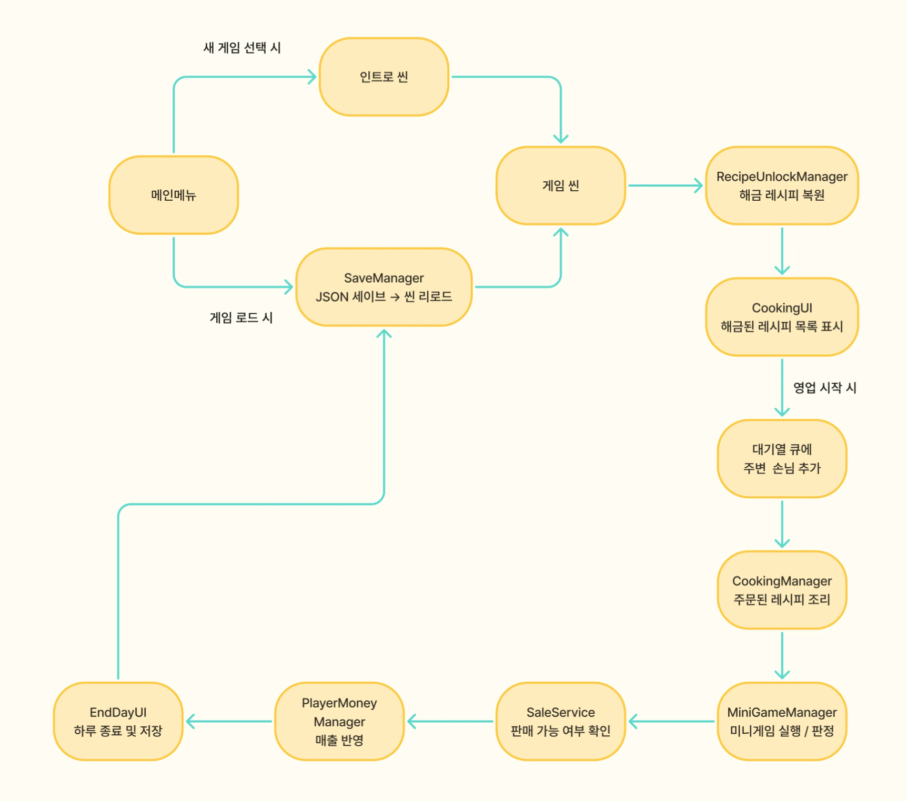
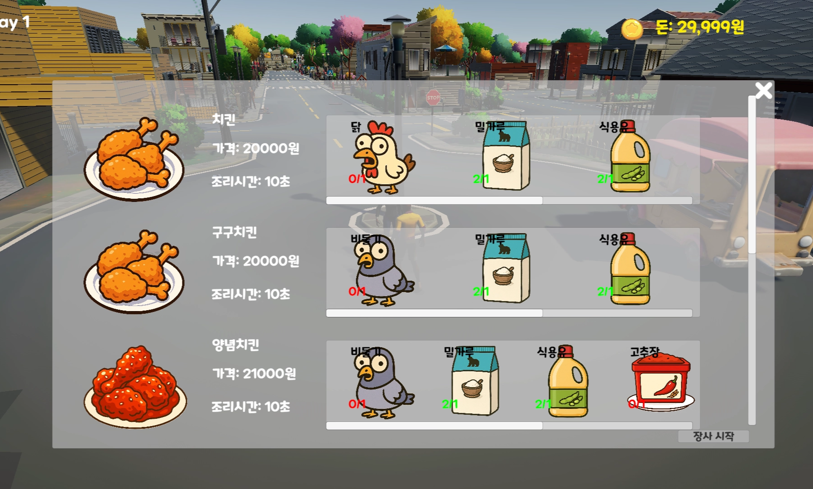
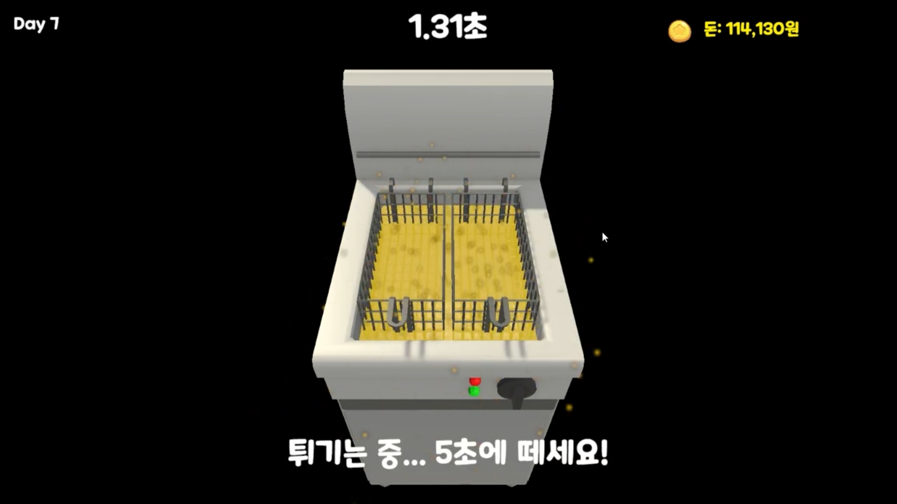

# Illegal K-Food Truck Simulator


> 닭 대신 비둘기를 파는 불법 푸드트럭 게임
> 

플레이어는 어느 날 꿈속에서 **정체불명의 할머니**에게 **치킨 레시피**를 전수받는다.

비법의 핵심은 닭 대신 비둘기를 튀기는 것

도시에서 비둘기를 잡아 치킨으로 속여 팔며 돈을 벌수록,

도시는 점점 **비둘기**로 가득해지는데…

99일을 버티면 할머니와 마을의 진실이 드러난다….

---

# 개요

| 항목 | 내용 |
| --- | --- |
| **개발 기간** | 2025.09-2025.11 |
| **엔진** | Unity 6 |
| **장르** | 라이트 경영 + 생활 시뮬레이션 |
| **시점 / 톤** | 쿼터뷰 / 로우폴리 병맛 유머 |
| 개발 인원 | 1인 개발 |
| **모티브** | 초등학교 시절 도시괴담 “학교 앞 치킨은 비둘기로 만든다” |
| **GitHub** | [https://github.com/techn-0/Illegal-K-Food-Truck-Simulator](https://github.com/techn-0/Illegal-K-Food-Truck-Simulator) |
| **플레이 영상** | [https://youtu.be/DVLwJ0lvbDw?si=6gKffxfFAceazt7A](https://youtu.be/DVLwJ0lvbDw?si=6gKffxfFAceazt7A) |

# 시스템

## 핵심 스크립트 요약

| 시스템 | 핵심 클래스 | 설명 |
| --- | --- | --- |
| **인벤토리** | `Inventory.cs`, `InventorySlot.cs` | 슬롯 기반 스택형 인벤토리의 추가/제거·조회 및 저장용 직렬화 제공 |
| **요리 미니게임** | `CookingManager`, `MinigameBase`, `MiniGameManager` | 레시피 잠금·재료 보유 검사 후 재료 소비, 요리 미니게임 진행 및 완료 처리 |
| **레시피 해금** | `RecipeUnlockManager` | ScriptableObject ID 매핑 기반 레시피 잠금/해제 및 복원 관리 |
| **판매 / 경제** | `SaleService`, `PlayerMoneyManager` | 판매 가능 판정, 거래 처리
판매 시 해당 물품 인벤토리에서 차감, 수익 반영 |
| **저장 / 불러오기** | `SaveManager`, `GameManager` | 
JSON으로 게임 저장, 씬 로드 시 인벤토리, 레시피·재화 복원  |

## **시스템 간 연동 구조**

| 이벤트 흐름 | 데이터 흐름 |
| --- | --- |
| `RecipeUnlockManager` → `CookingUI` | 해금된 레시피 목록 표시 |
| `CookingUI` → `CookingManager` | 플레이어가 요리 선택 |
| `CookingManager` → `MiniGameManager` | 미니게임 실행 및 결과 판정 |
| `MiniGameResult` → `SaleService` | 완성품 판매 가능 여부 확인 |
| `SaleService` → `PlayerMoneyManager` → `MoneyDisplayUI` | 수익 반영 및 UI 업데이트 |
| `GameManager` ↔︎ `SaveManager` | 저장 / 불러오기 처리 |

---

## **게임 시스템 플로우**



---

# 핵심 기능 설계

## 1. 손님 대기열 : 거리 정렬 및 위치 계산 (`OrderManager.cs`)


> 동적으로 추가되는 손님들을 트럭 기준 거리순으로 실시간 정렬하고, 각 손님에게 줄 서기 위치를 자동 계산해 NavMesh 이동 목표로 전달
> 

```csharp
// 손님 등록 → 거리순 정렬 → Queue 재구성 → 전체 위치 재배분까지 한 흐름으로 처리
public void EnqueueCustomer(CustomerOrderSystem customer)
{
    if (customer == null || _queuedCustomers.Contains(customer)) return;

    _queuedCustomers.Add(customer);

    // 트럭과 가까운 순으로 재정렬
    if (sortByDistance && OrderPoint != null)
        SortQueueByDistance();

    RebuildQueue();          // List → Queue 재구성
    UpdateQueuePositions();  // 전체 손님 위치 재배분
}

// 트럭에 가까운 손님이 먼저 서도록 대기열을 재배치
private void SortQueueByDistance()
{
    _queuedCustomers = _queuedCustomers
        .OrderBy(c => Vector3.Distance(c.transform.position, OrderPoint.position))
        .ToList();
}

// 트럭 방향 기준으로 각 손님의 대기 위치를 결정
private Vector3 CalculateQueuePosition(int queueIndex)
{
		// 트럭 방향을 로컬 queueDirection에 투영해 월드 공간 방향 계산
    Vector3 actualDir = OrderPoint.forward  * queueDirection.z
                      + OrderPoint.right    * queueDirection.x
                      + OrderPoint.up       * queueDirection.y;

    // 첫 번째 손님은 OrderPoint 바로 앞, 이후 손님은 일정 간격 씩 뒤로 배치
    Vector3 pos = OrderPoint.position;
    if (queueIndex > 0)
        pos -= actualDir.normalized * (queueIndex * customerSpacing);

    return pos;
}
```

**설계 의도**

- 손님이 추가될 때마다 거리순 재정렬 + Queue 재구성을 하나의 흐름으로 묶어 항상 일관된 줄 서기 상태를 보장
- `queueDirection`을 월드 좌표가 아닌 트럭의 로컬 방향으로 계산해, 트럭 배치 방향에 상관없이 올바른 줄 방향이 자동 적용됨
- 손님이 목표 위치 도달 시 `CheckArrival()`로 도착을 확인하며, 첫 번째 손님만 즉시 주문을 시작하고 이후 손님은 앞 순서가 끝날 때까지 대기하는 구조

---

## 2. 요리 파이프라인 : 재료 검증 → 소모 → 미니게임 (`CookingManager.cs`)





> 레시피 해금 상태·재료 보유량 검증 → 재료 소모 → 타이머 기반 요리 진행 → 완료 이벤트로 결과물 지급까지 단방향 파이프라인으로 구성
> 

```csharp
public bool CanCookRecipe(RecipeDefinition recipe)
{
    if (isCooking) return false;
    // 레시피 해금 상태 확인
    if (RecipeUnlockManager.Instance != null &&
        !RecipeUnlockManager.Instance.IsRecipeUnlocked(recipe)) return false;
    // 재료 보유량 확인
    foreach (var ingredient in recipe.RequiredIngredients)
        if (!PlayerInventory.HasItem(ingredient.Ingredient, ingredient.RequiredAmount))
            return false;
    return true;
}

public void StartCooking(RecipeDefinition recipe)
{
    // 재료 소모
    foreach (var ingredient in recipe.RequiredIngredients)
        PlayerInventory.RemoveItem(ingredient.Ingredient, ingredient.RequiredAmount);

    isCooking = true;
    cookingTimer.StartTimer(recipe, recipe.CookingTime);
    OnCookingStarted?.Invoke(recipe, recipe.CookingTime);
}

private void OnTimerCompleted(RecipeDefinition recipe)
{
    PlayerInventory.Add(recipe.ResultDish, recipe.ResultAmount); // 결과 요리 지급
    isCooking = false;
    OnCookingCompleted?.Invoke(recipe); // 판매 시스템 등 구독자에게 완료 알림
}
```

**설계 의도**

- `CanCookRecipe`와 `StartCooking`을 분리해 UI에서 버튼 활성화 판단과 실제 요리 로직을 독립적으로 호출 가능
- 이벤트(`OnCookingStarted / OnCookingCompleted`)로 요리 결과를 외부에 전달해 CookingManager가 UI·판매 시스템에 직접 의존하지 않음

---

## 3. ScriptableObject 기반 레시피 : 랭크별 가격 계산 (`RecipeDefinition.cs`)

> `CreateAssetMenu`로 에디터에서 레시피 에셋을 직접 생성·수정 가능
> 

```csharp
[CreateAssetMenu(fileName = "New Recipe", menuName = "Cooking/Recipe Definition")]
public class RecipeDefinition : ScriptableObject
{
    [SerializeField] private string recipeId;
    [SerializeField] private RecipeIngredient[] requiredIngredients;
    [SerializeField] private ItemDefinition resultDish;
  
    // 미니게임 진행 순서(ex. 재료 손질 -> 반죽 -> 튀기기)
    [SerializeField] private MinigameId[] minigameSequence;

    // 미니게임 결과에 따른 판매 가격: S(+50%) ~ F(-50%)
    public int GetPriceByRank(char rank)
    {
        float multiplier = rank switch
        {
            'S' => 1.5f, 'A' => 1.2f, 'B' => 1.0f,
            'C' => 0.8f, 'F' => 0.5f, _   => 1.0f
        };
        return Mathf.RoundToInt(basePrice * multiplier);
    }
}

[System.Serializable]
public class RecipeIngredient
{
    [SerializeField] private ItemDefinition ingredient;
    [SerializeField] private int requiredAmount;
    public ItemDefinition Ingredient   => ingredient;
    public int            RequiredAmount => requiredAmount;
}
```

**설계 의도**

- ScriptableObject 에셋 단위로 레시피를 관리해 빌드 없이 콘텐츠 추가·수정 가능
- `RecipeId` 문자열로 저장/복원하는 구조로, 씬 전환이나 에셋 위치 변경에도 데이터가 안전하게 유지됨

---

## 4. MVP 패턴 : 플레이어 애니메이션 분리

> **핵심 포인트:** 애니메이션 로직을 Model(상태) · View(Animator 제어) · Presenter(연결)로 분리해 NPC 등 다른 캐릭터도 같은 구조로 재사용 가능하도록 설계
> 

```csharp
// PlayerAnimationModel.cs: 순수 상태 데이터만 보유, Unity API에 의존하지 않음
public class PlayerAnimationModel
{
    public bool IsWalking { get; private set; }
    public void SetWalking(bool value) => IsWalking = value;
}

// PlayerAnimationView.cs: 애니메이션 컨트롤러와 상호작용
public class PlayerAnimationView : MonoBehaviour
{
    [SerializeField] private Animator animator;
    private const string IsWalkFParam = "isWalkF";

    public void SetWalkingAnimation(bool isWalking)
        => animator?.SetBool(IsWalkFParam, isWalking);
}

// PlayerAnimationPresenter.cs: Model 업데이트 후 View에 렌더 요청 — 단방향 흐름
public class PlayerAnimationPresenter
{
    private readonly PlayerAnimationModel _model;
    private readonly PlayerAnimationView  _view;

    public PlayerAnimationPresenter(PlayerAnimationModel m, PlayerAnimationView v)
        => (_model, _view) = (m, v);

    public void UpdateWalkingState(bool isWalking)
    {
        _model.SetWalking(isWalking);          // 1. 상태 갱신
        _view.SetWalkingAnimation(_model.IsWalking); // 2. 렌더 반영
    }
}
```

**설계 의도**

- Model이 Unity API(`MonoBehaviour`, `Animator`)에 의존하지 않아 단독 유닛 테스트 가능
- Presenter를 통한 단방향 흐름으로 View가 Model을 직접 참조하는 순환 의존 방지

---

## **5. CSV 기반 분기 대화 시스템**


> **핵심 포인트:** CSV 한 파일로 대화 흐름 전체를 정의하고, `"텍스트|nextId;텍스트|nextId"` 포맷의 선택지를 런타임에 파싱해 분기 진행. 대화 완료 시 돈·아이템·레시피 보상을 인스펙터 설정만으로 지급
> 

```csharp
// CSVLoader
else if (c == '\n' && !inQuotes)
{ rows.Add(current.ToString()); current.Clear(); }

// ChoiceParser — "예|102;아니요|201" 포맷을 (text, nextId) 튜플 리스트로 변환
foreach (string part in raw.Split(';'))
{
    string[] kv = part.Trim().Split('|');
    if (kv.Length == 2 && int.TryParse(kv[1].Trim(), out int id))
        choices.Add((kv[0].Trim(), id));
}

// DialogueManager — ID로 노드 탐색, 선택지 유무에 따라 분기 또는 순차 진행
private void ShowDialogueLine(DialogueLine line)
{
    currentLine = line;
    view.RenderLine(line); // View에 텍스트·초상화 렌더링 위임
    if (line.isChoice)
        view.ShowChoices(ChoiceParser.Parse(line.choicesRaw), OnChoiceSelected);
    else
        view.ClearChoices();
}

// DialogueTarget — 대화 종료 콜백에서 보상 일괄 지급 후 씬 전환까지 연계
public void OnDialogueComplete()
{
    GiveMoneyReward();
    GiveItemRewards();
    UnlockRecipeRewards();
    onDialogueComplete?.Invoke();
    if (loadSceneAfterDialogue) StartCoroutine(LoadSceneAfterDelay());
}
```

**설계 의도**

- CSV 파일만 교체하면 코드 수정 없이 새 대화·보상 이벤트 추가 가능
- `ChoiceParser`를 독립 정적 클래스로 분리해 파싱 로직을 재사용 가능하도록 설계
- `DialogueTarget` 컴포넌트를 NPC에 붙이고 인스펙터에서 보상을 설정하면 각 대화별  보상 설정 가능

---

# **트러블슈팅**

## **1. UI–로직 결합 문제를 MVP 패턴으로 분리**

개발 초기, 인벤토리와 대화 UI가 로직과 직접 연결되어 있어 기능을 추가하거나 수정할 때마다 UI까지 함께 수정해야 하는 구조적 문제를 발견, 이를 해결하기 위해 두 시스템을 MVP 패턴으로 전면 리팩터링함.

모델은 순수 데이터만 관리하고, 프레젠터가 변화 이벤트를 받아 뷰를 갱신하는 구조로 분리

그 결과 인벤토리는 모델에서 아이템 변경 이벤트를 발행하면 프레젠터가 이를 받아 UI를 자동으로 갱신하는 구조가 되었고, 대화 시스템은 CSV 파일만 교체해도 신규 대화 이벤트를 추가할 수 있어 확장성이 향상됨.

또한 플레이어 애니메이션을 상태·렌더링·제어 구조로 나누면서 NPC도 같은 로직을 재사용할 수 있는 구조가 되었음

---

## **2. 반복 빌드 문제를 ScriptableObject 데이터 구조로 개선**

레시피와 아이템 데이터가 코드에 하드코딩되어 있어 콘텐츠 데이터를 수정할 때마다 빌드를 반복해야 하는 비효율이 발생함.

이를 해결하기 위해 레시피와 아이템을 모두 ScriptableObject로 분리하고 ID 기반 참조 구조로 재설계

그 결과 ScriptableObject 자산만 생성하거나 수정해도 코드 변경 없이 즉시 게임에 반영할 수 있게 되었으며, 콘텐츠 제작 속도가 크게 향상되었음

---

# **배운 점**

- 이벤트 기반 구조로 **UI-로직 결합도 최소화**
- ScriptableObject 설계의 **데이터 내구성** 이해 (ID 매핑, 폴백 로딩)
- 씬 초기화/복원 타이밍 문제 해결을 통해 **Unity 비동기 구조 학습**
- 대기열·판매 루프 등 **비결정적 이벤트의 동기화** 경험